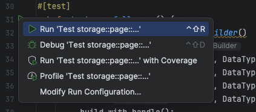
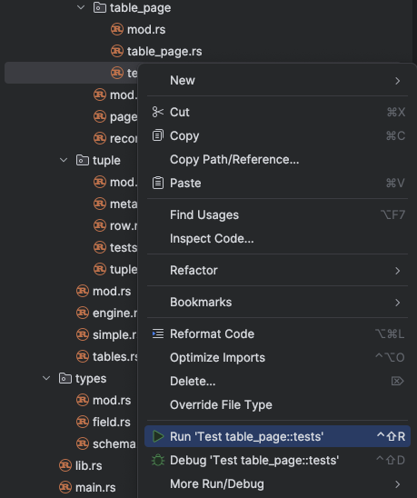
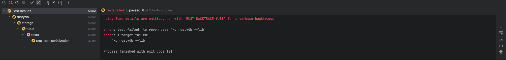
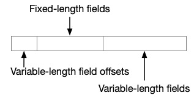
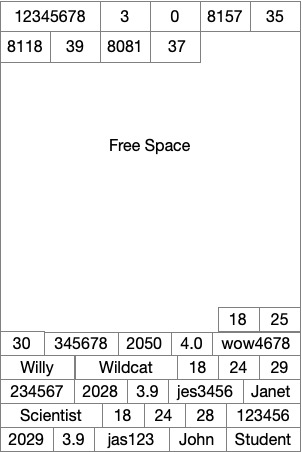
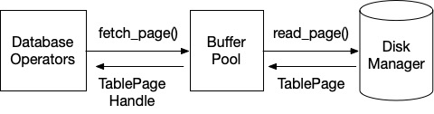

# Lab 2: Storage Manager

## Introduction

In this lab students will implement a simplified storage back-end for RustyDB. First you will pack tuples into pages and
pages into a heap file. After that, we will implement the buffer pool for maintaining the DBMS's state - its in-memory
pages.

In each part of the lab, you will implement a module and we may provide an example test or two to demonstrate how to
check your work. You should also write your own tests to ensure your implementation is correct. We will be grading this
with a set of private tests in Gradescope. You may resubmit your hand-in as many times as you wish for feedback.

## Setup

### Install Rust

The first thing would always to [install](https://www.rust-lang.org/tools/install) Rust and its build tool Cargo. If
this is your first time working with Rust, we highly recommend glancing through the [Rust Book](https://doc.rust-lang.org/book/)
to gain a general understanding of the language.

### Configuring Your IDE

IDEs (Integrated Development Environments) are graphical software development environments that can help you manage 
larger projects. For Rusty-DB, we strongly recommend using RustRover. 

RustRover is a dedicated Rust IDE developed by JetBrains, offering powerful features specifically tailored for Rust 
development. You can find installation instruction [here](https://www.jetbrains.com/help/rust/installation-guide.html#-nhkivi_144).

Finally, to work with Rusty-DB, click Open and navigate to the folder where you have stored the project. It will load 
the project and display the code. RustRover may ask you if you to [trust the project](https://www.jetbrains.com/help/rust/project-security.html#projects_security)
when you first open it. Select "Trust Project" to enable full access to RustRover's features for this project.


### Testing Your Code

We've given some example tests under the `tests.rs` file within each module. These tests will not pass until their 
corresponding code has been completed. These tests are by no means comprehensive. Thus, we expect you to create some 
tests to verify your code. 

There are two main ways to run tests for Rusty-DB: using RustRover's built-in test runner or using Cargo commands. 
Both methods are effective, so choose the one that best fits your workflow.

Using RustRover:

To run a single test: Place your cursor on the test method and press Ctrl+Shift+R. Alternatively, 
click the gutter icon next to the test class or test method and select Run '<test name>' from the list.



To run all tests in a folder: Select this folder in the Project tool window and press Ctrl+Shift+R or right-click and 
select Run Tests in '[folder name]' from the context menu.



After RustRover finishes running your tests, it shows the results in the Run tool window on the tab for that run 
configuration. 



Using cargo: 

To run a specific test by name:

`cargo test <test_name>`

This will run any test (unit or integration) with a name that matches <test_name>.

To run all tests in a specific module: 
`cargo test <module_path>`

Where <module_path> is the full path to the module, using double colons (::) as separators. For example, to run tests 
for buffer pool manager, you shall run `cargo test buffer_pool_manager::tests`.

## Heap File Storage

We will now walk through the storage scheme for RustyDB's tuples and how we store them in tables with pages.

### Tuple Layout

We want to create variable-length tuples with a layout like this:




Assume all ints are 32-bits and floats are 4 bytes long too. We store our strings as variable length strings. For
example, the string “testing” will occupy 7 bytes.

To make finding the serialized data easier, we pack fixed-length fields first after our spec for the lengths of the
variable length ones. Each field length is stored in 2 bytes. We can deduce the length of our last field by looking at
the allocated size of a tuple.

For example, consider the schema:

```student(id int, netid varchar(15), class_year int, gpa float, first_name varchar(25), last_name varchar(25))```

Say that we start with the following rows:

```
(123456, jas123, 2029, 3.9, John, Student)
(234567, jes3456, 2028, 3.9, Janet, Scientist)
(345678, wow4678, 2050, 4.0, Willy, Wildcat)
```

Our tuple layout for the last row would be:


The first 6 bytes give us the offsets for the variable length fields. The next 12 bytes are for the fixed length fields.
The remaining bytes store the text fields.

#### Exercise 1: Tuple Layout

In RustyDB we have a `tuple` - or a byte array that stores a row's values with the layout above. We also have a `row` -
an object that stores a vector of a tuple's fields. The latter is used for evaluating expressions,
e.g., `student.gpa > 3.0`.

As a warmup, implement the serialization of tuples in `storage/tuple/row.rs`.

*(Hint: How can you get the start and end
index for a variable length field from tuple header data?)*

At this point, your code shall pass the unit tests under `storage/tuple/tests.rs`.

### Table Pages

Our next step is storing batches of these tuples in pages. We will use a fixed page size specified in `common/config.rs`
as `RUSTY_DB_PAGE_SIZE_BYTES`. We will store tuples in a page in this format:


Our header has this setup with their size in bytes in parentheses:


When we insert a tuple, we write to the bytes at the end of the free space. We then append the row's start offset to the
end of the header.

In our running example of three rows above, if our page size is 8192 bytes we would have the following layout for our
page:



#### Exercise 2: Page Layout

Using this page layout, finish implementing the `Page` trait for `TablePage` in `storage/page/table_page/table_page.rs`,
by filling in `get_tuple`, `insert_tuple`, `get_tuple_metadata`, `update_tuple_metadata`, `get_is_dirty`,
and `set_is_dirty`.

The trait definition can be found in `storage/page/page.rs`. You should also write tests to verify that your
implementation works with ad-hoc schemas
and tuples. Hint: randomness can help expose bugs in your implementation.

At this point, your code shall pass the unit tests under `table_page/tests.rs`.

## LRU-K Replacer

Next we will design, implement, and test an eviction algorithm for your buffer pool. This algorithm will select the page
we will delete from the buffer pool when we need to make more room in the buffer pool to service a new `fetch_page`
request.

We will be implementing a simplified version of
the [LRU-K replacement algorithm](https://www.cs.cmu.edu/~natassa/courses/15-721/papers/p297-o_neil.pdf) for this. This
algorithm keeps track of the last $k$ timestamps at which each page was accessed. It then calculates the $k$-distance as
the difference between `now` and the $k$-th last time it was acessed. For example, if $k=2$, and it was accessed at
timestamps 4 and 2, and our current time is 7, then our $k$-distance is 5. We want to select the evictable frame with
the maximum k distance. If a frame has not been accessed at least $k$ times, it has a $k$ distance of infinity. If
multiple frames have a k distance of infinity, then we want the algorithm to select the evictable frame with the
earliest overall timestamp.

At this point, your code shall pass the unit tests under `lru_k_replacer/tests.rs`.

## Buffer Pool

Your last task will be to implement our management of the DBMS's in-memory state. We will create a centralized memory
manager that maps the pages from disk into memory so that our database operators can access their contents. The buffer
pool, it maintains a fixed set of pages in memory and orchestrates reading and writing pages to disk.

Our workflow is as follows:



When a query's database operator requests a page, it does so by invoking the buffer pool's `fetch_page` method. This
will dispatch the disk manager to go to the correct offset in the heap file for the requested page ID. The disk manager
will then return the page to the buffer pool which will then cache it in the pool's fixed memory. The requesting
operator will receive a handle to this page. If more than one operator requests the same page, both may hold a handle to
it. When we fetch a page, we will also pin it in memory. The page will remain in the buffer pool until it is unpinned.
If greater than one operator requests the same page, then each increments the pin count.

When a page's pin count reaches zero, the page becomes unpinned. An unpinned page is eligible for eviction when the
buffer pool is full. When we evict a page, if it is unchanged then we can simply replace it in our in-memory cache. But
if the page has been updated, we will mark it as dirty. All dirty pages must be flushed to persistent storage by the
disk manager upon eviction.

At this point, your code shall pass the unit tests under `buffer_pool_manager/tests.rs` and `heap/tests.rs`.


### Task Summary

row.rs:

- [ ] `Row::deserialize(bytes: Vec<u8>, schema: &Table) -> Self`

table_page.rs

- [ ] `impl Page for TablePage { }`
    - [ ] `get_tuple(&self, rid: &RecordId) -> Result<Tuple>`
    - [ ] `insert_tuple(&mut self, meta: TupleMetadata, tuple: Tuple) -> Option<Self::InsertOutputType>`
    - [ ] `get_tuple_metadata(&self, rid: &RecordId) -> Result<TupleMetadata>`
    - [ ] `update_tuple_metadata(&mut self, metadata: &TupleMetadata, rid: &RecordId) -> Result<()>`
    - [ ] `get_is_dirty(&self) -> bool`
    - [ ] `set_is_dirty(&mut self, is_dirty: bool) -> bool`

lru_k_replacer.rs:

- [ ] `LRUKNode::get_backwards_k_distance(&self, current_timestamp: usize) -> usize`
- [ ] `LRUKNode::has_infinite_backwards_k_distance(&self) -> bool`
- [ ] `LRUKReplacer::evict(&mut self) -> Option<FrameId>`
- [ ] `LRUKReplacer::record_access(&mut self, frame_id: &FrameId, _access_type: AccessType)`
- [ ] `LRUKReplacer::set_evictable(&mut self, frame_id: &FrameId, set_evictable: bool)`
- [ ] `LRUKReplacer::remove(&mut self, frame_id: &FrameId)`

buffer_pool_manager.rs:

- [ ] `new_page(&mut self) -> Option<PageId>`
- [ ] `fetch_page(&mut self, page_id: &PageId) -> Option<TablePageHandle>`
- [ ] `unpin_page(&mut self, page_id: &PageId, is_dirty: bool) -> bool`
- [ ] `flush_page(&mut self, page_id: &PageId)`
- [ ] `flush_all_pages(&mut self)`
- [ ] `delete_page(&mut self, page_id: PageId) -> bool`

